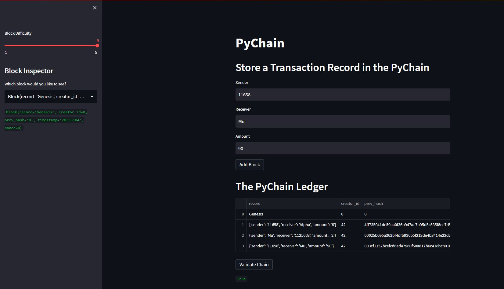
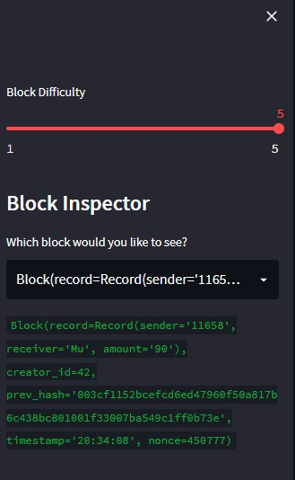
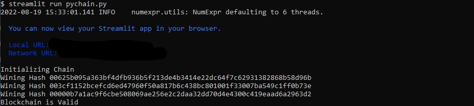

# PyChain Ledger

---

### You’ll make the following updates to the provided Python file for this

### Challenge, which already contains the basic `PyChain` ledger structure that

### you created throughout the module:

---

---

# Contributors

- Severo Fernandez

severocf@gmail.com

---

# License
[MIT]